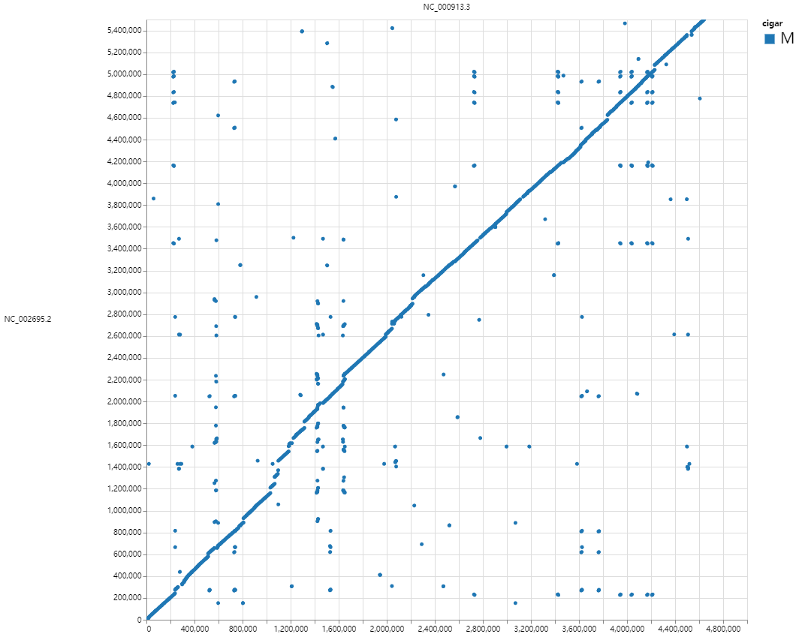
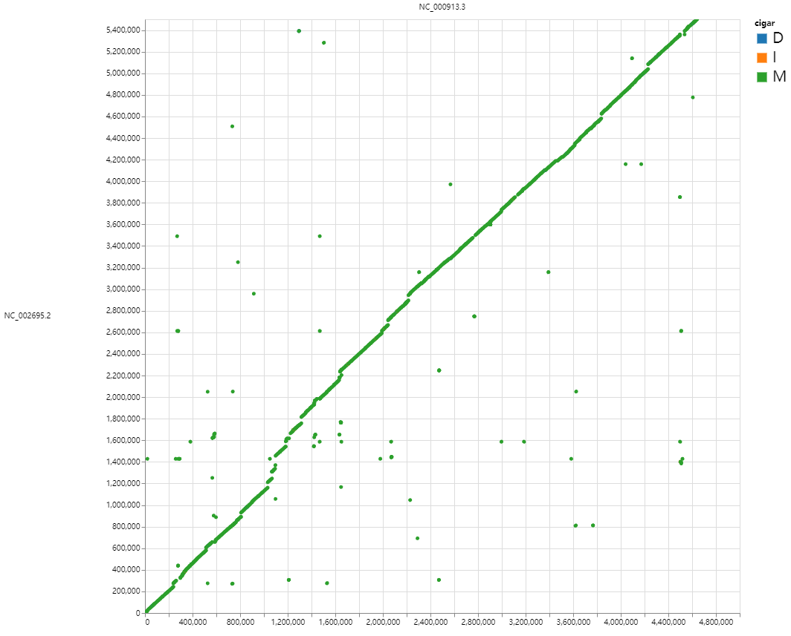
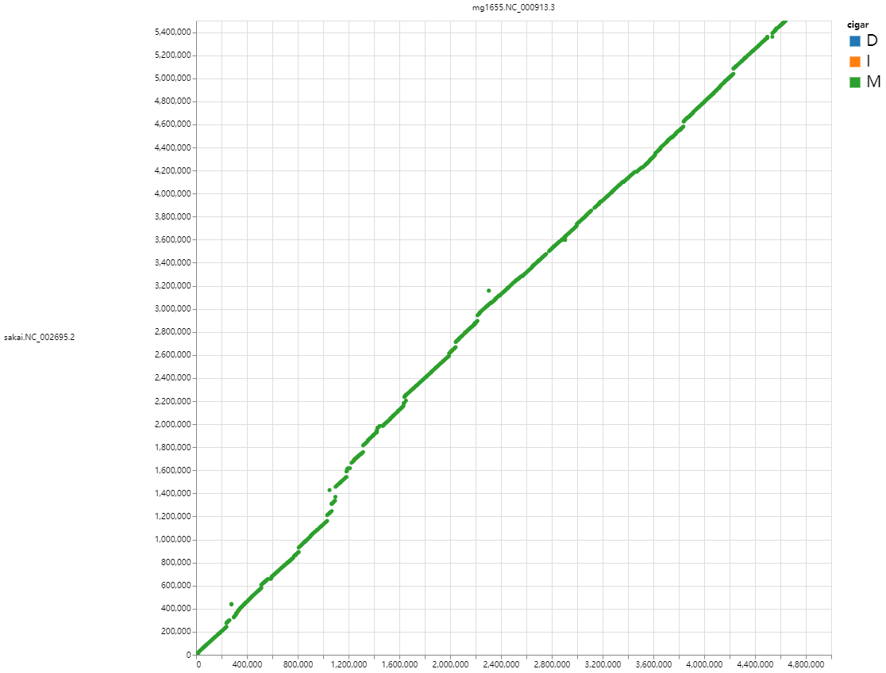
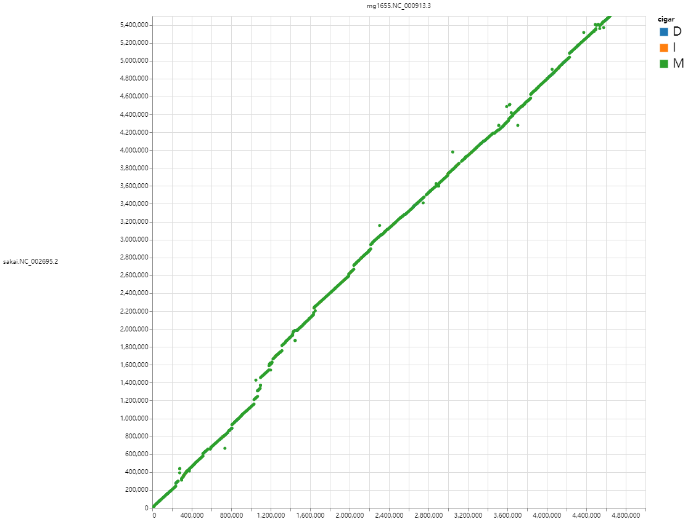

# hnsm - **H**omogeneous **N**ucleic acids/amino acids **S**mart **M**atching

[](https://github.com/wang-q/hnsm/actions)
[](https://codecov.io/gh/wang-q/hnsm)
[](https://github.com//wang-q/hnsm)

`hnsm` is a high-performance bioinformatics toolkit for sequence analysis and comparison. It
provides:

- 🚀 Fast sequence alignment and comparison
- 🧬 Support for both DNA and protein sequences
- 🧠 Smart matching algorithms for sequence clustering
- 📊 Comprehensive analysis tools for genomic data
- ⚡️ Parallel processing for large datasets

<!-- TOC -->
* [hnsm - **H**omogeneous **N**ucleic acids/amino acids **S**mart **M**atching](#hnsm---homogeneous-nucleic-acidsamino-acids-smart-matching)
  * [Install](#install)
  * [Synopsis](#synopsis)
    * [`hnsm help`](#hnsm-help)
    * [`fasr help`](#fasr-help)
  * [Examples](#examples)
    * [FA files](#fa-files)
    * [Index](#index)
    * [FQ](#fq)
    * [Clustering](#clustering)
      * [Similarity and dissimilarity (distance) of vectors](#similarity-and-dissimilarity-distance-of-vectors)
      * [Pairwise distances by Minimizer](#pairwise-distances-by-minimizer)
      * [Matrix conversion](#matrix-conversion)
      * [DBSCAN](#dbscan)
      * [PCoA](#pcoa)
    * [Block FA files](#block-fa-files)
    * [Genomes](#genomes)
  * [Author](#author)
  * [License](#license)
<!-- TOC -->

## Install

Current release: 0.2.0

```shell
cargo install --path . --force #--offline

# local repo
# cargo clean
# rm Cargo.lock

# test
cargo test -- --test-threads=1

# bench
cargo bench --bench simd

# local docs
# Linux
RUSTDOCFLAGS="--html-in-header katex-header.html" cargo doc --no-deps --document-private-items --open
# Windows Powershell
$env:RUSTDOCFLAGS="--html-in-header ./katex-header.html"
cargo doc --no-deps --document-private-items --open

# build under WSL 2
mkdir -p /tmp/cargo
export CARGO_TARGET_DIR=/tmp/cargo
cargo build

```

## Synopsis

### `hnsm help`

```text
Homogeneous Nucleic acids/amino acids Smart Matching

Usage: hnsm [COMMAND]

Commands:
  chain       Chains of syntenic genes
  cluster     Clustering based on pairwise distances
  convert     Conversion between pairwise distances and a distance matrix
  count       Count base statistics in FA file(s)
  das         Domain architecture similarity
  dedup       Deduplicate records in FA file(s)
  distance    Estimate distances between DNA/protein sequences using minimizers
  filter      Filter records in FA file(s)
  gz          Compressing a file using the blocked gzip format (BGZF)
  interleave  Interleave two PE files
  mask        Soft/hard-masking regions in FA file(s)
  masked      Identify masked regions in FA file(s
  n50         Count total bases in FA file(s)
  one         Extract one FA record by name
  order       Extract some FA records in the order specified by a list
  range       Extract sequences defined by the range(s)
  rc          Reverse complement a FA file
  replace     Replace headers of a FA file based on a TSV mapping
  manifold    Manifold learning based on pairwise distances
  similarity  Calculate similarity between vectors
  sixframe    Six-Frame Translation
  size        Count total bases in FA file(s)
  some        Extract some FA records based on a list of names
  split       Split FA file(s) into several files
  help        Print this message or the help of the given subcommand(s)

Options:
  -h, --help     Print help
  -V, --version  Print version


Subcommand groups:

* Fasta files
    * info: size / count / masked / n50
    * records: one / some / order / split
    * transform: replace / rc / filter / dedup / mask / sixframe
    * indexing: gz / range
        * `hnsm gz` writes out the BGZF format and `hnsm range` reads it

* Fastq files
    * interleave

* Clustering
    * DNA/protein: distance
    * vectors: similarity
    * convert
    * cluster
    * manifold

* Synteny
    * das
    * chain

```

### `fasr help`

```text
`fasr` operates block fasta files

Usage: fasr [COMMAND]

Commands:
  axt2fas    Convert axt to block fasta
  check      Check genome locations in block fasta headers
  concat     Concatenate sequence pieces of the same species
  consensus  Generate consensus sequences by POA
  cover      Output covers on chromosomes
  create     Create block fasta files from links of ranges
  filter     Filter blocks, and can also be used as a formatter
  join       Join multiple block fasta files by a common target
  link       Output bi/multi-lateral range links
  maf2fas    Convert maf to block fasta
  name       Output all species names
  pl-p2m     Pipeline - pairwise alignments to multiple alignments
  refine     Realign files with external programs and trim unwanted regions
  replace    Concatenate sequence pieces of the same species
  separate   Separate block fasta files by species
  slice      Extract alignment slices
  split      Split block fasta files to per-alignment/chromosome fasta files
  stat       Extract a subset of species
  subset     Extract a subset of species
  variation  List variations (substitutions/indels)
  xlsx       List variations (substitutions/indels)
  help       Print this message or the help of the given subcommand(s)

Options:
  -h, --help     Print help
  -V, --version  Print version

```

## Examples

### FA files

```shell
hnsm size tests/fasta/ufasta.fa
hnsm count tests/fasta/ufasta.fa.gz
hnsm masked tests/fasta/ufasta.fa
hnsm n50 tests/fasta/ufasta.fa -N 90 -N 50 -S -t

hnsm one tests/fasta/ufasta.fa read12
hnsm some tests/fasta/ufasta.fa tests/fasta/list.txt
hnsm order tests/fasta/ufasta.fa tests/fasta/list.txt

hnsm filter -a 10 -z 50 -U tests/fasta/ufasta.fa
hnsm filter -a 1 -u tests/fasta/ufasta.fa tests/fasta/ufasta.fa.gz
hnsm filter --iupac --upper tests/fasta/filter.fa

hnsm dedup tests/fasta/dedup.fa
hnsm dedup tests/fasta/dedup.fa -s -b -f stdout

hnsm mask --hard tests/fasta/ufasta.fa tests/fasta/mask.json

hnsm replace tests/fasta/ufasta.fa tests/fasta/replace.tsv
hnsm rc tests/fasta/ufasta.fa

hnsm filter -a 400 tests/fasta/ufasta.fa |
    hnsm split name stdin -o tmp
hnsm split about -c 2000 tests/fasta/ufasta.fa -o tmp

hnsm sixframe tests/fasta/trans.fa
hnsm sixframe tests/fasta/trans.fa --len 3 --start --end

```

### Index

`samtools faidx` is designed for fast randomized extraction of sequences from reference sequences,
and requires that the sequence file be "well-formatted", i.e., all sequence lines must be the same
length, which is to facilitate random access to disk files. For a mammal reference genome, this
requirement is reasonable; loading a 100M chromosome into memory would take up more resources and
reduce speed.

However, for bacterial genome or metagenome sequences, loading a complete sequence has no impact,
and `hnsm range` will use the LRU cache to store the recently used sequences to reduce disk accesses
and thus speed up the process. In addition, plain text files use the same indexing format as BGZF.

```shell
# gz
bgzip -c tests/index/final.contigs.fa > tests/index/final.contigs.fa.gz;
bgzip -r tests/index/final.contigs.fa.gz

hnsm gz tests/index/final.contigs.fa -o tmp

# range
samtools faidx tests/index/final.contigs.fa
samtools faidx tests/index/final.contigs.fa \
    "k81_130" "k81_130:11-20" "k81_170:304-323" "k81_170:1-20" "k81_158:70001-70020"
samtools faidx tests/index/final.contigs.fa -r tests/index/sample.rg

hnsm range tests/index/final.contigs.fa.gz \
    "k81_130" "k81_130:11-20" "k81_170:304-323" "k81_170(-):1-20" "k81_158:70001-70020"
hnsm range tests/index/final.contigs.fa.gz -r tests/index/sample.rg

```

### FQ

```shell
hnsm interleave tests/fasta/ufasta.fa.gz tests/fasta/ufasta.fa

hnsm interleave tests/fasta/ufasta.fa

hnsm interleave --fq tests/fasta/ufasta.fa

hnsm interleave --fq tests/fastq/R1.fq.gz tests/fastq/R2.fq.gz

hnsm interleave --fq tests/fastq/R1.fq.gz

```

### Clustering

#### Similarity and dissimilarity (distance) of vectors

```shell
hnsm similarity tests/clust/domain.tsv --mode euclid --bin

hnsm similarity tests/clust/domain.tsv --mode cosine --bin

hnsm similarity tests/clust/domain.tsv --mode jaccard --bin

hyperfine --warmup 1 \
    -n p1 \
    'hnsm similarity data/Domian_content_1000.tsv --mode jaccard --bin -p 1 > /dev/null' \
    -n p2 \
    'hnsm similarity data/Domian_content_1000.tsv --mode jaccard --bin -p 2 > /dev/null' \
    -n p3 \
    'hnsm similarity data/Domian_content_1000.tsv --mode jaccard --bin -p 3 > /dev/null' \
    -n p4 \
    'hnsm similarity data/Domian_content_1000.tsv --mode jaccard --bin -p 4 > /dev/null' \
    -n p6 \
    'hnsm similarity data/Domian_content_1000.tsv --mode jaccard --bin -p 6 > /dev/null' \
    -n p8 \
    'hnsm similarity data/Domian_content_1000.tsv --mode jaccard --bin -p 8 > /dev/null' \
    --export-markdown sim.md.tmp

```

* AMD Ryzen 7 8745HS

| Command |       Mean [s] | Min [s] | Max [s] |    Relative |
|:--------|---------------:|--------:|--------:|------------:|
| `p1`    | 12.340 ± 0.270 |  11.762 |  12.697 | 3.79 ± 0.15 |
| `p2`    |  6.952 ± 0.219 |   6.553 |   7.268 | 2.14 ± 0.10 |
| `p3`    |  5.383 ± 0.344 |   5.171 |   6.287 | 1.66 ± 0.12 |
| `p4`    |  4.375 ± 0.162 |   4.046 |   4.585 | 1.35 ± 0.07 |
| `p6`    |  3.602 ± 0.069 |   3.445 |   3.712 | 1.11 ± 0.04 |
| `p8`    |  3.252 ± 0.106 |   2.984 |   3.390 |        1.00 |

#### Pairwise distances by Minimizer

```text
$ hnsm distance tests/clust/IBPA.fa -k 7 -w 1 |
    hnsm convert stdin --mode matrix
IBPA_ECOLI      0       0.0669  0.2014  0.2106  0.4405  0       0.0011  0.7124  0.5454  0.3675
IBPA_ECOLI_GA   0.0669  0       0.114   0.1464  0.2917  0.0669  0.068   1       0.7023  0.5974
IBPA_ECOLI_GA_LV        0.2014  0.114   0       0.0344  0.132   0.2014  0.2024  1       0.7023  1
IBPA_ECOLI_GA_LV_ST     0.2106  0.1464  0.0344  0       0.0895  0.2106  0.2117  1       0.7023  1
IBPA_ECOLI_GA_LV_RK     0.4405  0.2917  0.132   0.0895  0       0.4405  0.4416  1       0.7023  1
IBPA_ESCF3      0       0.0669  0.2014  0.2106  0.4405  0       0.0011  0.7124  0.5454  0.3675
A0A192CFC5_ECO25        0.0011  0.068   0.2024  0.2117  0.4416  0.0011  0       0.7134  0.5464  0.3686
Q2QJL7_ACEAC    0.7124  1       1       1       1       0.7124  0.7134  0       1       0.6134
A0A010SUI8_PSEFL        0.5454  0.7023  0.7023  0.7023  0.7023  0.5454  0.5464  1       0       0.7023
K1J4J6_9GAMM    0.3675  0.5974  1       1       1       0.3675  0.3686  0.6134  0.7023  0

```

```text
$ clustalo -i tests/clust/IBPA.fa --auto --full --distmat-out=tests/clust/IBPA.mat
10
IBPA_ECOLI          0.000000 0.058394 0.160584 0.197080 0.277372 0.000000 0.000000 0.583942 0.540146 0.372263
IBPA_ECOLI_GA       0.058394 0.000000 0.102190 0.138686 0.218978 0.058394 0.058394 0.627737 0.576642 0.416058
IBPA_ECOLI_GA_LV    0.160584 0.102190 0.000000 0.036496 0.116788 0.160584 0.160584 0.671533 0.635036 0.496350
IBPA_ECOLI_GA_LV_ST 0.197080 0.138686 0.036496 0.000000 0.080292 0.197080 0.197080 0.656934 0.642336 0.518248
IBPA_ECOLI_GA_LV_RK 0.277372 0.218978 0.116788 0.080292 0.000000 0.277372 0.277372 0.700730 0.671533 0.569343
IBPA_ESCF3          0.000000 0.058394 0.160584 0.197080 0.277372 0.000000 0.000000 0.583942 0.540146 0.372263
A0A192CFC5_ECO25    0.000000 0.058394 0.160584 0.197080 0.277372 0.000000 0.000000 0.589928 0.546763 0.372263
Q2QJL7_ACEAC        0.583942 0.627737 0.671533 0.656934 0.700730 0.583942 0.589928 0.000000 0.628378 0.518248
A0A010SUI8_PSEFL    0.540146 0.576642 0.635036 0.642336 0.671533 0.540146 0.546763 0.628378 0.000000 0.496350
K1J4J6_9GAMM        0.372263 0.416058 0.496350 0.518248 0.569343 0.372263 0.372263 0.518248 0.496350 0.000000

```

* proteomes

```shell
curl -L https://ftp.ncbi.nlm.nih.gov/genomes/all/GCF/000/005/845/GCF_000005845.2_ASM584v2/GCF_000005845.2_ASM584v2_protein.faa.gz \
    > tests/clust/mg1655.pro.fa.gz

curl -L https://ftp.ncbi.nlm.nih.gov/genomes/all/GCF/000/008/865/GCF_000008865.2_ASM886v2/GCF_000008865.2_ASM886v2_protein.faa.gz \
    > tests/clust/sakai.pro.fa.gz

curl -L https://ftp.ncbi.nlm.nih.gov/genomes/all/GCF/000/006/765/GCF_000006765.1_ASM676v1/GCF_000006765.1_ASM676v1_protein.faa.gz \
    > tests/clust/pao1.pro.fa.gz

hnsm distance tests/clust/mg1655.pro.fa.gz tests/clust/pao1.pro.fa.gz -k 7 -w 2 |
    rgr filter stdin --ne 3:1

hyperfine --warmup 1 \
    -n p1 \
    'hnsm distance tests/clust/mg1655.pro.fa.gz tests/clust/pao1.pro.fa.gz -k 7 -w 2 -p 1 > /dev/null' \
    -n p2 \
    'hnsm distance tests/clust/mg1655.pro.fa.gz tests/clust/pao1.pro.fa.gz -k 7 -w 2 -p 2 > /dev/null' \
    -n p3 \
    'hnsm distance tests/clust/mg1655.pro.fa.gz tests/clust/pao1.pro.fa.gz -k 7 -w 2 -p 3 > /dev/null' \
    -n p4 \
    'hnsm distance tests/clust/mg1655.pro.fa.gz tests/clust/pao1.pro.fa.gz -k 7 -w 2 -p 4 > /dev/null' \
    -n p6 \
    'hnsm distance tests/clust/mg1655.pro.fa.gz tests/clust/pao1.pro.fa.gz -k 7 -w 2 -p 6 > /dev/null' \
    -n p8 \
    'hnsm distance tests/clust/mg1655.pro.fa.gz tests/clust/pao1.pro.fa.gz -k 7 -w 2 -p 8 > /dev/null' \
    --export-markdown dis.md.tmp

hyperfine --warmup 1 \
    -n p1 \
    'hnsm distance tests/clust/mg1655.pro.fa.gz tests/clust/pao1.pro.fa.gz -k 7 -w 2 --zero -p 1 > /dev/null' \
    -n p2 \
    'hnsm distance tests/clust/mg1655.pro.fa.gz tests/clust/pao1.pro.fa.gz -k 7 -w 2 --zero -p 2 > /dev/null' \
    -n p3 \
    'hnsm distance tests/clust/mg1655.pro.fa.gz tests/clust/pao1.pro.fa.gz -k 7 -w 2 --zero -p 3 > /dev/null' \
    -n p4 \
    'hnsm distance tests/clust/mg1655.pro.fa.gz tests/clust/pao1.pro.fa.gz -k 7 -w 2 --zero -p 4 > /dev/null' \
    -n p6 \
    'hnsm distance tests/clust/mg1655.pro.fa.gz tests/clust/pao1.pro.fa.gz -k 7 -w 2 --zero -p 6 > /dev/null' \
    -n p8 \
    'hnsm distance tests/clust/mg1655.pro.fa.gz tests/clust/pao1.pro.fa.gz -k 7 -w 2 --zero -p 8 > /dev/null' \
    --export-markdown dis.md.tmp

```

* AMD Ryzen 7 8745HS

| Command |       Mean [s] | Min [s] | Max [s] |    Relative |
|:--------|---------------:|--------:|--------:|------------:|
| `p1`    | 24.840 ± 0.377 |  24.161 |  25.319 | 8.36 ± 0.45 |
| `p2`    | 11.150 ± 0.153 |  10.958 |  11.481 | 3.75 ± 0.20 |
| `p3`    |  6.877 ± 0.083 |   6.743 |   7.022 | 2.31 ± 0.12 |
| `p4`    |  5.178 ± 0.107 |   5.033 |   5.317 | 1.74 ± 0.10 |
| `p6`    |  3.745 ± 0.205 |   3.508 |   4.080 | 1.26 ± 0.10 |
| `p8`    |  2.972 ± 0.155 |   2.842 |   3.347 |        1.00 |

| Command |       Mean [s] | Min [s] | Max [s] |    Relative |
|:--------|---------------:|--------:|--------:|------------:|
| `p1`    | 32.044 ± 0.776 |  30.726 |  32.970 | 8.78 ± 0.25 |
| `p2`    | 15.014 ± 0.110 |  14.842 |  15.212 | 4.12 ± 0.07 |
| `p3`    |  9.182 ± 0.080 |   8.987 |   9.246 | 2.52 ± 0.04 |
| `p4`    |  6.885 ± 0.087 |   6.735 |   6.974 | 1.89 ± 0.04 |
| `p6`    |  4.569 ± 0.110 |   4.492 |   4.831 | 1.25 ± 0.04 |
| `p8`    |  3.648 ± 0.055 |   3.587 |   3.774 |        1.00 |

* Six-frame

```shell
hnsm sixframe tests/pgr/sakai.fa.gz --len 35 |
    hnsm distance stdin tests/clust/mg1655.pro.fa.gz -k 7 -w 2 -p 4 |
    wc -l
#21124

hnsm range tests/pgr/sakai.fa.gz "NC_002695(+):4468532-4468696|frame=1"

```

#### Matrix conversion

```shell
hnsm convert tests/clust/IBPA.fa.tsv --mode matrix

hnsm convert tests/clust/IBPA.fa.tsv --mode lower

hnsm convert tests/clust/IBPA.mat --mode pair

```

#### DBSCAN

```shell
hnsm cluster tests/clust/IBPA.fa.tsv --mode dbscan --eps 0.05 --min_points 2

cat tests/clust/IBPA.fa.tsv |
    tsv-filter --le 3:0.05 |
    hnsm cluster stdin --mode cc

```

#### PCoA

```shell
cargo run --bin hnsm manifold tests/clust/IBPA.fa.tsv --mode pcoa --dim 2

```

### Block FA files

```shell
fasr maf2fas tests/fasr/example.maf

fasr axt2fas tests/fasr/RM11_1a.chr.sizes tests/fasr/example.axt --qname RM11_1a

fasr filter tests/fasr/example.fas --ge 10

fasr name tests/fasr/example.fas --count

fasr cover tests/fasr/example.fas

fasr cover tests/fasr/example.fas --name S288c --trim 10

fasr concat tests/fasr/name.lst tests/fasr/example.fas

fasr subset tests/fasr/name.lst tests/fasr/example.fas
fasr subset tests/fasr/name.lst tests/fasr/refine.fas --required

fasr link tests/fasr/example.fas --pair
fasr link tests/fasr/example.fas --best

fasr replace tests/fasr/replace.tsv tests/fasr/example.fas
fasr replace tests/fasr/replace.fail.tsv tests/fasr/example.fas

samtools faidx tests/fasr/NC_000932.fa NC_000932:1-10

fasr check tests/fasr/NC_000932.fa tests/fasr/A_tha.pair.fas

fasr create tests/fasr/genome.fa tests/fasr/I.connect.tsv --name S288c

# Create a fasta file containing multiple genomes
cat tests/fasr/genome.fa | sed 's/^>/>S288c./' > tests/fasr/genomes.fa
samtools faidx tests/fasr/genomes.fa S288c.I:1-100

cargo run --bin fasr create tests/fasr/genomes.fa tests/fasr/I.name.tsv --multi

fasr separate tests/fasr/example.fas -o . --suffix .tmp

spoa tests/fasr/refine.fasta -r 1

cargo run --bin fasr consensus tests/fasr/example.fas
cargo run --bin fasr consensus tests/fasr/refine.fas
cargo run --bin fasr consensus tests/fasr/refine.fas --outgroup -p 2

cargo run --bin fasr refine tests/fasr/example.fas
cargo run --bin fasr refine tests/fasr/example.fas --msa none --chop 10
cargo run --bin fasr refine tests/fasr/refine2.fas --msa clustalw --outgroup
cargo run --bin fasr refine tests/fasr/example.fas --quick

cargo run --bin fasr split tests/fasr/example.fas --simple
cargo run --bin fasr split tests/fasr/example.fas -o . --chr --suffix .tmp

cargo run --bin fasr slice tests/fasr/slice.json tests/fasr/slice.fas --name S288c

cargo run --bin fasr join tests/fasr/S288cvsYJM789.slice.fas --name YJM789
cargo run --bin fasr join \
    tests/fasr/S288cvsRM11_1a.slice.fas \
    tests/fasr/S288cvsYJM789.slice.fas \
    tests/fasr/S288cvsSpar.slice.fas

cargo run --bin fasr stat tests/fasr/example.fas --outgroup

cargo run --bin fasr variation tests/fasr/example.fas
cargo run --bin fasr variation tests/fasr/example.fas --outgroup

cargo run --bin fasr xlsx tests/fasr/example.fas
cargo run --bin fasr xlsx tests/fasr/example.fas --outgroup

cargo run --bin fasr pl-p2m tests/fasr/S288cvsRM11_1a.slice.fas tests/fasr/S288cvsSpar.slice.fas

```

### Genomes

* genomes

```shell
curl -L https://ftp.ncbi.nlm.nih.gov/genomes/all/GCF/000/005/845/GCF_000005845.2_ASM584v2/GCF_000005845.2_ASM584v2_genomic.fna.gz |
    gzip -dc |
    hnsm filter stdin -s |
    hnsm gz stdin -o tests/pgr/mg1655.fa

curl -L https://ftp.ncbi.nlm.nih.gov/genomes/all/GCF/000/008/865/GCF_000008865.2_ASM886v2/GCF_000008865.2_ASM886v2_genomic.fna.gz |
    gzip -dc |
    hnsm filter stdin -s |
    hnsm gz stdin -o tests/pgr/sakai.fa

```

* plot

```shell
hnsm distance tests/pgr/sakai.fa.gz tests/pgr/mg1655.fa.gz -k 21 -w 1
#NC_002695       NC_000913       0.0677  0.4520  0.5793
#NC_002127       NC_000913       1.9925  0.0000  0.0006
#NC_002128       NC_000913       1.2133  0.0001  0.0052

hnsm distance tests/pgr/sakai.fa.gz tests/pgr/mg1655.fa.gz -k 21 -w 1 --all
#tests/pgr/sakai.fa.gz   tests/pgr/mg1655.fa.gz  5394043 4562542 3071076 6885509 0.0690  0.4460  0.5693

FastGA -v -pafx tests/pgr/sakai.fa.gz tests/pgr/mg1655.fa.gz > tmp.paf
FastGA -v -psl tests/pgr/sakai.fa.gz tests/pgr/mg1655.fa.gz > tmp.psl

pgr chain -t="" tests/pgr/mg1655.fa.gz tests/pgr/sakai.fa.gz tmp.psl > tmp.chain.maf
pgr chain --syn -t="" tests/pgr/mg1655.fa.gz tests/pgr/sakai.fa.gz tmp.psl > tmp.syn.maf

lastz <(gzip -dcf tests/pgr/mg1655.fa.gz) <(gzip -dcf tests/pgr/sakai.fa.gz) |
    lavToPsl stdin stdout \
    > tmp.lastz.psl
pgr chain --syn -t="" tests/pgr/mg1655.fa.gz tests/pgr/sakai.fa.gz tmp.lastz.psl > tmp.lastz.maf

#wgatools maf2paf tmp.maf -o - |
#    sed 's/sakai\.fa\.//g' |
#    sed 's/mg1655\.fa\.//g' \
#    > tmp.paf
#PAFtoALN tmp.paf tests/pgr/sakai.fa.gz tests/pgr/mg1655.fa.gz
#ALNplot tmp -p -n0

wgatools dotplot -f paf tmp.paf > tmp.html
wgatools dotplot tmp.chain.maf > tmp.chain.html
wgatools dotplot tmp.syn.maf > tmp.syn.html
wgatools dotplot tmp.lastz.maf > tmp.lastz.html

#FastGA -v -1:tmp tests/pgr/sakai.fa.gz tests/pgr/mg1655.fa.gz
#ALNplot tmp -p -n0

```

|  |  |
|:--------------------------:|:------------------------------:|
|            paf             |             chain              |

|  |  |
|:--------------------------:|:------------------------------:|
|            syn             |             lastz              |

* repeats

```shell
# TnCentral
curl -LO https://tncentral.ncc.unesp.br/api/download_blast/nc/tn_in_is

unzip -j tn_in_is 'tncentral_integrall_isfinder.fa'
gzip -9 -c 'tncentral_integrall_isfinder.fa' > tncentral.fa.gz

hnsm size tests/pgr/tncentral.fa.gz
hnsm distance tests/pgr/tncentral.fa.gz -k 17 -w 5 -p 8 |
    rgr filter stdin --ge 5:0.9

# RepBase for RepeatMasker
curl -LO https://github.com/wang-q/ubuntu/releases/download/20190906/repeatmaskerlibraries-20140131.tar.gz

tar xvfz repeatmaskerlibraries-20140131.tar.gz Libraries/RepeatMaskerLib.embl

# https://sourceforge.net/projects/readseq/
java -jar ~/bin/readseq.jar -f fa Libraries/RepeatMaskerLib.embl
mv Libraries/RepeatMaskerLib.embl.fasta repbase.fa
gzip -9 -k repbase.fa

```

* RepeatMasker

```shell
singularity run ~/bin/repeatmasker_master.sif /app/RepeatMasker/RepeatMasker \
    ./genome.fa -xsmall -species "bacteria"

singularity run ~/bin/repeatmasker_master.sif /app/RepeatMasker/util/rmOutToGFF3.pl \
    ./genome.fa.out > mg1655.rm.gff

spanr gff tests/pgr/mg1655.rm.gff -o tests/pgr/mg1655.rm.json

```

```shell
pgr ir tests/pgr/tncentral.fa.gz tests/pgr/mg1655.fa.gz \
    > tests/pgr/mg1655.ir.json

spanr stat tests/pgr/mg1655.chr.sizes tests/pgr/mg1655.ir.json

pgr rept tests/pgr/mg1655.fa.gz \
    > tests/pgr/mg1655.rept.json

pgr trf tests/pgr/mg1655.fa.gz \
    > tests/pgr/mg1655.trf.json

spanr stat tests/pgr/mg1655.chr.sizes tests/pgr/mg1655.rm.json
spanr statop tests/pgr/mg1655.chr.sizes tests/pgr/mg1655.ir.json tests/pgr/mg1655.rm.json

lastz tests/pgr/pseudocat.fa tests/pgr/pseudopig.fa |
    lavToPsl stdin stdout \
    > tests/pgr/lastz.psl

pgr chain tests/pgr/pseudocat.fa tests/pgr/pseudopig.fa tests/pgr/lastz.psl

lastz --self <(gzip -dcf tests/pgr/mg1655.fa.gz)

```

## Author

Qiang Wang <wang-q@outlook.com>

## License

MIT.

Copyright by Qiang Wang.

Written by Qiang Wang <wang-q@outlook.com>, 2024.
